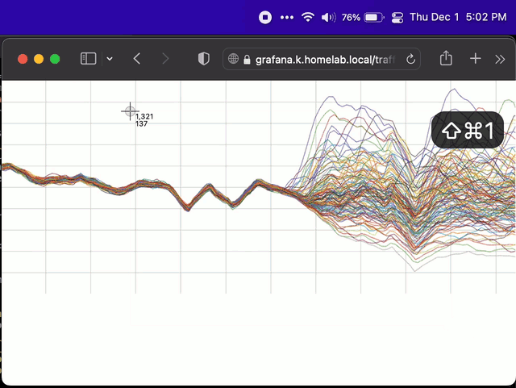

# What is this?

This repo contains a bunch of janky glue for publishing (annotated) screenshots and putting a link in the pasteboard.

It's just for funsies.  This isn't a "product": there's no installer and it won't work for you as-is.  Best case, it gives you something to go off of.

It took me a while to figure out how to make it all fit together though, so I thought I'd document it for the next person, and that's this repo.




## But... why?

A core part of my workflow is taking screenshots, annotating them, and uploading them somewhere they can be unfurled in Slack etc.  I prefer not to copy/paste the images directly into Slack because then they can't be easily referred to outside of that Slack team.

## Why not just use X, Y, or Z?

Years ago monosnap had great annotation and also let you upload screenshots to your own s3 bucket.  Nowadays you have to create a monosnap account just to download it, and all the fancy uploaders are paywalled.  I had used Zappy for a long time but they haven't implemented uploads to one's own s3 bucket yet.

I took a look at [Shottr](https://shottr.cc/) and it does everything I want in terms of annotation, but it doesn't do any uploading, just saves images to a local directory (which is great, don't get me wrong).  In addition it is missing a creature comfort of monosnap and Zappy which is a dropdown menu where you can see your previous screenshots and get their published links back.

## Okay how does this thing work then?

1. launchd has a `QueueDirectories` directive that lets you run something when files arrive in a directory, and Hammerspoon can do more or less anything you want with UI.  [`io.philsnow.shots-filed.eueue`](io.philsnow.shots-filed.queue) is a launchd service that runs a bash script when a queue directory has anything in it.

1. I set up Shottr to put screen captures into a queue directory, but you can use anything that drops files into that directory.  Keep in mind that they'll be moved away since it's a QueueDirectory.

1. That bash script, [`shots-filed.sh`](shots-filed.sh), uploads anything in the queue directory to s3 and then moves them to an 'done' directory.

1. I have that s3 bucket set up for web hosting (maybe it's through CloudFront?  I honestly don't remember.).

1. [`shots-filed.lua`](shots-filed.lua) has a `hs.pathwatcher` that watches the 'done' directory and when any files are created, it updates its menubar item to show the last 10 uploads and then puts a link to the latest one in the pasteboard.

Note, there's tons of stuff that's just hard-coded like my username and home directory, s3 bucket name, and that I use `aws-vault`, so nothing will probably work for you out of the box.

Getting everything right with launchd was a pain for me, because I'm not a Mac native and because most of the documentation is under-specified and old.  If you just do `launchd load -w ~/Library/LaunchAgents/...`, `aws-vault` won't be running in the correct "domain" and it won't have access to your keychain.  Instead you have to:

```
% # making it go:
% launchctl enable gui/501/io.philsnow.shots-filed.queue
% launchctl bootstrap gui/501 ~/Library/LaunchAgents/io.philsnow.shots-filed.queue.plist

% # making it stop:
% launchctl bootout gui/501 ~/Library/LaunchAgents/io.philsnow.shots-filed.queue.plist
% launchctl disable user/501/io.philsnow.shots-filed.queue
```

## What do now?

- TODO: requires SF Pro font to be installed(?), choose a better default icon
- TODO: cache the menubar item thumbnails because 9/10 of them will usually be reused
- TODO: `shots-filed.lua` will probably choke if you put any files that `hs.image` chokes on
